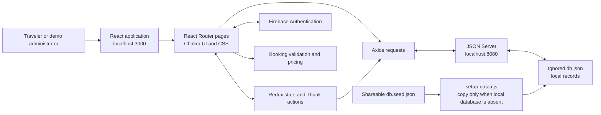

# Chalo Ghume — SE3290 Travel Booking Application

## Submission information

| Item | Status |
| --- | --- |
| Student name and ID | To be supplied by the student |
| Instructor, course section, and submission date | To be supplied by the student |
| Application revision | Completed local working revision; final publication destination is pending |
| Submission repository | Final destination and publication pending |
| Runtime | React at `http://localhost:3000`; JSON Server at `http://localhost:8080`; Firebase Authentication |
| Public deployment | This revision has not been publicly deployed |
| Demonstration | Seven-minute script prepared; actual recording and narration/caption choice pending |

## 1. Background and attribution

Chalo Ghume is an educational travel-booking application inspired by Expedia. It combines hotel and flight searches, destination activities, phone authentication, demonstration reservations, a Trips page, and catalog administration. The project provides a practical setting for integrating a React interface, shared state, an HTTP data service, and an external identity provider.

This submission adapts an existing application. The original project credits **Kumkum (team lead), Ashish, Amit, Sagar Balsaraf, and Sarim**, and identifies [kumkumdutta/interesting-stretch-8935](https://github.com/kumkumdutta/interesting-stretch-8935) as its upstream repository. This checkout originated from [ddang175/se3290-expedia-clone](https://github.com/ddang175/se3290-expedia-clone). That origin is not evidence that the current changes have been published there. Attribution is preserved in the [README](../README.md); inherited screens and assets are not presented as entirely new student work. No license has been invented for the original project.

The SE3290 revision contributes reproducible local setup, centralized configuration, repaired authentication and catalog interactions, working demonstration bookings and Trips, administrative CRUD, focused automated checks, and submission documentation. Student identification and the final repository/recording links remain to be added.

## 2. Objectives and scope

The objectives are to:

1. Support a coherent journey from a hotel or flight search to a selected item and a saved demonstration reservation.
2. Make supported search, sorting, and filtering controls affect the displayed catalog.
3. Integrate Firebase phone authentication and preserve the intended account state across a page refresh.
4. Separate shareable sample inventory from local account and reservation data.
5. Provide explicit administrator access in the interface and working catalog maintenance actions.
6. Validate important behavior and document the result accurately enough for another reviewer to reproduce it.

The application uses sample inventory. It does not check live supplier availability, send reservations to hotels or airlines, or process payments. A status of `confirmed` denotes a successfully saved local demonstration booking. Checkout collects a synthetic traveler's name and email; it does not collect card details.

## 3. Architecture and technology

React renders the interface, React Router selects pages, and Redux/Redux Thunk manage shared state and asynchronous actions. Axios communicates with JSON Server through the shared API base URL. Firebase Authentication handles phone verification separately from the catalog and booking store.



| Layer | Technology | Responsibility |
| --- | --- | --- |
| Interface | React 18, React DOM | Component rendering and interactions |
| Navigation | React Router 6 | Search, accounts, checkout, Trips, and admin routes |
| State | Redux 4, React Redux 8, Redux Thunk 2 | Shared catalog/account state and asynchronous actions |
| Styling | Chakra UI 2, Emotion, CSS, styled-components | Controls, layout, and presentation |
| Requests | Axios 1 | Local API reads and mutations |
| Identity | Firebase JavaScript SDK 9.19.0 in the verified installation | Phone verification |
| Data | JSON Server 0.17.4 | REST-style access to local demonstration records |
| Build and tests | `react-scripts` 5, Jest, React Testing Library | Development, production build, and regression checks |
| Supporting UI | React Icons, Font Awesome, Datepicker, Toastify | Icons and supporting interface utilities |

The lockfile records the installed dependency versions. Local verification used **Node.js 26.5.0 and npm 11.17.0**. The included GitHub Actions workflow targets **Node.js 22**; its presence does not imply that a remote run has occurred.

### Source responsibilities

| Source | Purpose |
| --- | --- |
| `src/index.js`, `src/App.js` | Application providers and shared page shell |
| `src/Pages/AllRoutes.jsx` | Route configuration |
| `src/Components/ProtectedRoute.jsx` | Signed-in and administrator checks in the interface |
| `src/Pages/Stay/`, `src/Pages/Flights/` | Search forms, catalog filtering, sorting, and selections |
| `src/Pages/ThingsTodo/` | Activity destination/text search and feedback |
| `src/Pages/Login.jsx`, `src/Pages/Register.jsx` | Phone authentication and account forms |
| `src/Redux/Authantication/` | Account API operations and session persistence |
| `src/services/booking.js` | Date/traveler validation, price quotation, and booking construction |
| `src/Pages/CheckoutPage.jsx`, `src/Pages/Trips.jsx` | Saving bookings and reviewing the account's trips |
| `src/Pages/Admin/`, `src/Redux/AdminFlights/`, `src/Redux/AdminHotel/` | Catalog forms, lists, counts, and CRUD actions |
| `src/baseurl.js`, `src/01_firebase/config_firebase.js` | API and Firebase environment configuration |
| `scripts/` | Local database creation and explicit administrator assignment |

### Data and reservation flow

The shareable seed contains **239 hotels, 22 flights, 54 activities, and 19 gift cards**, with empty `users`, `bookings`, `hotelcart`, and `flightcart` collections. Local accounts, temporary admin records, and reservations are stored in ignored `db.json`. Server startup copies the seed only when the local database is absent, preserving local data on restart.

An isolated temporary-directory check verified that the setup helper created a database with 239 hotels and empty users/bookings, then preserved an added local user on its second run.

Hotel search normalizes common location names and applies destination, price, rating, and sort choices. The data cleanup explicitly identified cities for **72 hotels**; **167 remain without an explicit city** rather than receiving guessed locations. Search can also match relevant existing listing text. The same cleanup was applied to the seed and local inventory.

A selection carries its type, record ID, dates, and traveler count into checkout. Checkout fetches that record, validates the inputs, and uses the booking service to calculate the total. Hotels are priced for one room by the number of nights, including per-night taxes. Flights are priced by traveler count. The service constructs a UUID booking associated with the signed-in account, and checkout awaits `POST /bookings` before showing Trips with its confirmation. Trips queries records for that account and retains saved results after a reload.

Cancellation controls are implemented: the interface requests confirmation before sending a status update. **The live cancellation result was not verified** because the automated UI action was blocked by automatic approval review and requires user approval. Its presence must not be described as an established end-to-end result.

### Identity and authorization boundaries

Normal sign-in uses session storage so the account survives refresh in the current browser tab. “Keep me signed in” uses persistent local storage; sign-out clears the saved session. Password fields from legacy account records are excluded from session data. New registrations receive the `user` role. An existing local account can be promoted through the explicit administrator helper, followed by a fresh sign-in.

`ProtectedRoute` redirects signed-out visitors to login and rejects non-admin access to admin pages. These are interface checks. **JSON Server does not validate Firebase ID tokens or enforce server-side roles and ownership.** The API remains a local learning service bound to loopback. Production use would require a backend that enforces those checks independently.

## 4. Local setup and deployment details

The complete setup is maintained in the [README](../README.md). Install the committed dependencies and create the local environment file:

```bash
npm ci
cp .env.example .env.local
```

Populate the Firebase web-app values in `.env.local` and keep `REACT_APP_API_BASE_URL=http://localhost:8080` for the default local API. Restart the development server after changing environment variables. `REACT_APP_*` values become part of the browser build; they must not contain server secrets. The environment file and local database are ignored and excluded from the shareable seed.

Configure the Firebase Phone provider and a private fictional number/code under **Phone numbers for testing**. The application adds India's `+91` country prefix to the ten national digits entered in its form. During setup, the user reported successful login after correcting the SMS region policy for India; a subsequent browser check also completed the configured fictional-number flow. This is an observed result, not a claim that fictional numbers always bypass region policy or that real SMS authentication is supported on every localhost setup. Firebase's current guide separately states that localhost is not a supported hosted domain for phone authentication. Follow its current requirements when configuring a hosted application. [Firebase phone-auth setup and testing](https://firebase.google.com/docs/auth/web/phone-auth)

Run the two local processes:

```bash
# Terminal 1: prepare local data if absent, then start the API.
npm run server
```

```bash
# Terminal 2: start the React development application.
npm start
```

The API binds to `127.0.0.1:8080`; the client is available at `http://localhost:3000`. A privately registered local account was assigned the explicit admin role for the verified administration checks. The README explains `npm run grant-admin -- YOUR_REGISTERED_10_DIGIT_NUMBER`; no account number or verification code is included in these documents.

`npm run build` creates static assets in `build/`. It does not publish the frontend or deploy its API. This revision **has not been publicly deployed**, and its final repository destination/publication remains pending. A remote client cannot use the student's localhost API as its public backend. A public release requires appropriate backend hosting and security, environment values, route fallback, Firebase configuration, and a deployment smoke test. Historical upstream links do not represent this revision.

## 5. Challenges and implemented solutions

| Challenge found during the initial audit | Implemented response and evidence |
| --- | --- |
| Mixed inherited hosted URLs and localhost endpoints | Centralized API configuration; verified catalog requests and admin edits use the local data service |
| Phone-auth region error and recursive reCAPTCHA callback | Compared project/test-number configuration, corrected the provider setup, removed the callback that restarted verification, and verified the normal Firebase sign-in flow in the browser |
| Account data and session state were inconsistent | Awaited account operations, removed password fields from saved sessions, implemented storage behavior, and verified account navigation and refresh |
| Search controls and catalog data did not agree | Connected query state, filters, and sorting; normalized location terms and assigned only supported city mappings |
| Checkout used static values with no saved booking | Fetch selected records, validate details, calculate totals, save UUID records, and display persistent Trips |
| Admin controls showed success too early or used incorrect record paths | Awaited create/PATCH/delete requests, added query-ID editing and full-catalog search, retained values on failure, and corrected reducers/dashboard links |
| Hotel rendering modified stored names | Removed the mutation and used visual truncation while preserving full record values |
| Setup depended on undeclared tooling and local data | Pinned JSON Server, added clean seed/setup helper, ignored local data and environment files, and added CI configuration |
| Starter test did not exercise application behavior | Replaced it with relevant tests across accounts, guards, catalogs, bookings, and administration |

## 6. Verification and results

The final local automated run passed **61 tests across 14 suites**. A final `CI=true npm run build` completed with **no application warnings**. A nonfatal outdated Browserslist-data notice remained. Scoped admin lint and whitespace checks also passed. These results describe local execution; no remote CI run or public deployment is implied.

The browser checks established the following:

| Workflow | Observed result |
| --- | --- |
| Firebase sign-in and session | The configured fictional number completed the normal Firebase flow. Account, Admin, and Trips navigation appeared; a full reload retained the sign-in. |
| Hotel search | Bangalore with October 10–12, 2026 retained its dates/query; ascending price and minimum rating 4 produced four results. |
| Hotel booking | Dbrooks, record 42, was quoted at ₹1,300 × 2 nights plus ₹468 taxes, totaling **₹3,068**. The booking was posted, a UUID confirmation appeared, and Trips survived reload. |
| Flight search and booking | Delhi → Mumbai for October 10, 2026 with the ₹5,000–₹6,000 filter returned IndiGo at ₹5,999. Two travelers totaled **₹11,998**; Trips displayed both saved bookings. |
| Activities | The page loaded 54 records; selecting Delhi and searching for Lotus returned one result. |
| Admin counts | The dashboard showed the baseline 239 hotels, 22 flights, and 54 activities. |
| Admin flight create/search/edit | A temporary QA Demo Air flight was added at ₹4,500, found through admin search, and updated with PATCH to **₹4,200**. The change appeared in public flight search. |

The temporary admin flight exists only in local demonstration data; the shareable seed remains at 22 flights. Booking totals are sample-data results, not real travel prices.

Automated tests cover additional account/session behavior, route guards, catalog rules, booking validation/pricing, and admin mutations/forms. **Hotel CRUD and catalog deletion have automated coverage but were not verified through a live browser mutation in this run.** Live cancellation remains pending the approval described above. No claim is made that every failure path or viewport received a manual check.

## 7. Future work

1. Replace JSON Server with a persistent backend that verifies Firebase tokens and enforces roles, ownership, input validation, and concurrency rules.
2. Add trusted inventory integrations, live availability/pricing confirmation, and supplier booking lifecycle handling.
3. Add a payment provider's test environment before considering actual payment processing.
4. Complete the remaining live cancellation and deletion checks with appropriate authorization, then expand end-to-end coverage and accessibility testing.
5. Improve unmapped hotel location data through supported source information, rather than guessing cities.
6. Add production deployment monitoring, structured error reporting, and repeatable release smoke tests.

## 8. Deliverable links

- [Seven-minute demonstration script](DEMO_WALKTHROUGH.md)
- [Deliverables and evidence record](DELIVERABLES.md)
- [Setup, project scope, and attribution](../README.md)
- [Contribution guide](../CONTRIBUTING.md)

The remaining submission items are student metadata, confirmation/publication of the final repository, and the actual demonstration recording with the chosen narration or caption format. Public hosting remains unperformed and must not be implied by a repository link.
